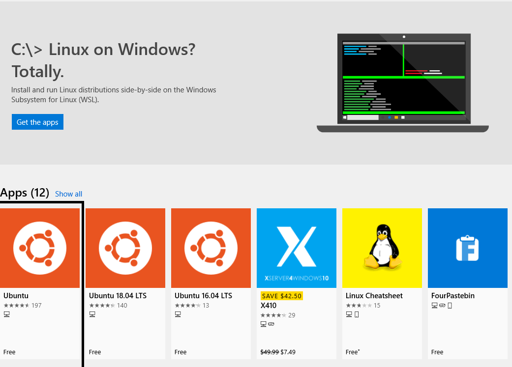

# Installing Everything You'll Need

To start off we are going to need a couple desktop applications and various accounts to online sites

## Install VS Code

* Head to [https://code.visualstudio.com/download](https://code.visualstudio.com/download).
* Then download the version for your operating system, 
* follow the onscreen prompt until it finishes,
* search your computer to make sure that the application has successfully been installed \(for windows 10, use cortana. For Mac OSx, use spotlight search or finder\)

## Install Python

For the prework we are going to be using Python 3.7. in order to get Python on your PC, go to [python.org](https://www.python.org/), navigate to the downloads tab, and click the button Python3.7.\*. the star means whatever version is there. When you get to the onscreen prompt to install python, you will see on the bottom of the first page 'add python to environment variables', MAKE SURE THIS IS SELECTED. This will save you a lot of confusion later on.

## Install PyCharm

PyCharm is going to be our IDE, integrated development environment, for our python code. In other words PyCharm is specifically made for using Python

To install PyCharm, go to [https://www.jetbrains.com/pycharm/](https://www.jetbrains.com/pycharm/). In the middle of the page click 'Download Now'. After that, click community, this is the free version. On the next page you should see the pycharm installer downloading. When it finishes, run it, click through the onscreen installer. When it finishes, it will say 'Run PyCharm Community Edition', click the button and hit finish. If PyCharm opens then it installed correctly

## Installing Git

Git is an amazing tool that almost all developers use, Git allows us to instantly push and pull code to and from the internet using 'repositories'. 

To install Git, go to [https://git-scm.com/](https://git-scm.com/) and click downloads halfway down the screen. Choose your operating system and wait for the installer to finish. Run the installer and click through the onscreen installer. There will be a lot of pages to click through but you won't damage anything by not reading

## Create a GitHub Account

Create an account at [https://github.com/](https://github.com/)

Github is an open source online software version control environment. Remember how I said git allows us to push code to the internet? We use github to host the code we push and we can view the code that other developers push here. This will come in handy later so make sure you pick a professional sounding name

## Gmail Setup

If you don't have one already, make sure you have a gmail account with a professional sounding handle. Later on when we start building resumes and portfolios it will be easy to send them along to any potential recruiters. Gmail is easy to setup so steps for installation won't be necessary here.

## Create LinkedIn Account

LinkedIn is the Social Media Platform for businesses and networking. Many recruiters will find you on LinkedIn, or ask for your LinkedIn. Your resume will also be hosted on here too so make sure it stays professional. 

This task is for admissions and career services. They will help guide you with making your profile look the most appealing to potential employers. It does not have to be perfect yet, but take consideration and time building it out.

## Windows Users

#### Linux Subsystem

We are also going to need a tool built into windows that will make our lives a lot easier. Windows and python are known to tango in the wrong with each other. How we can get around this, is using a windows built in feature that will create a new sub directory that python is familiar with. If you have ever had of Linux, we are basically creating \(not removing anything on your PC\) a new Linux environment. This feature is built into Windows 10 and is completely safe

#### Read Instructions first before executing, this install requires a restart

* Make sure windows is up to date
* Click the Cortana button or search bar, and type `windows features` 
* Click `turn windows features on or off` 
* A new window will appear, scroll down to the bottom and make sure `Windows subsystem for Linux` 
* Click OK, and restart your computer after everything closes if it does not prompt you to
* After logging back in, open up the Microsoft store by clicking the Cortana button or search bar, and type `microsoft store` 
* Up at the top, click search and search for `Ubuntu` . Ubuntu is a great, easy, popular Linux environment because of its ease of access and similarity to other operating systems.
* Click Ubuntu, use the image below as reference for what app to choose

* In the top right click `get` 
* Once the app has been installed click launch, this will do the initial install of the Ubuntu directory
* You can also get here by clicking on the Cortana button or the search bar, and type Ubuntu
* Once the install is complete, follow the prompt to create new UNIX usernames and password
* After that, you should see `{the username you enterered}@{your computers name}:~$` 
* If you see this, you are done. We will not be using this environment until the course starts. Go ahead and close it and continue to the next parts

