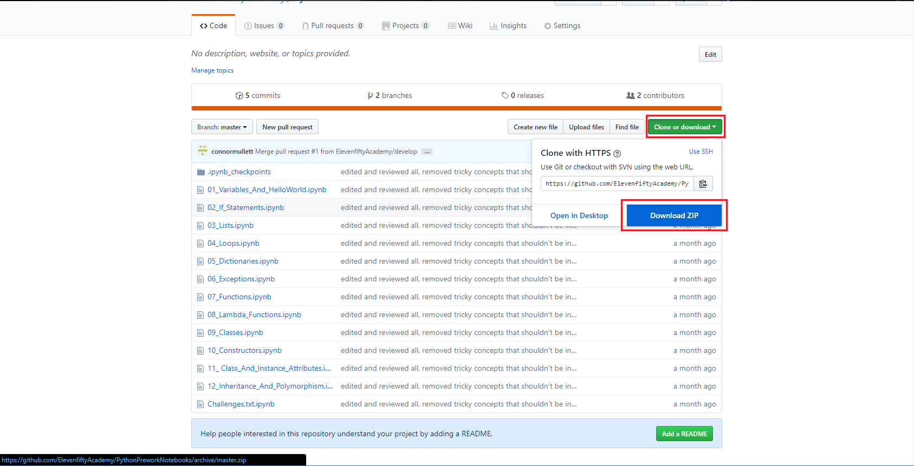
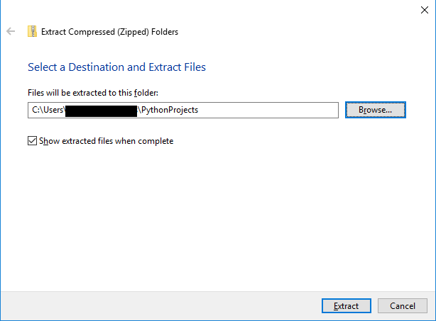
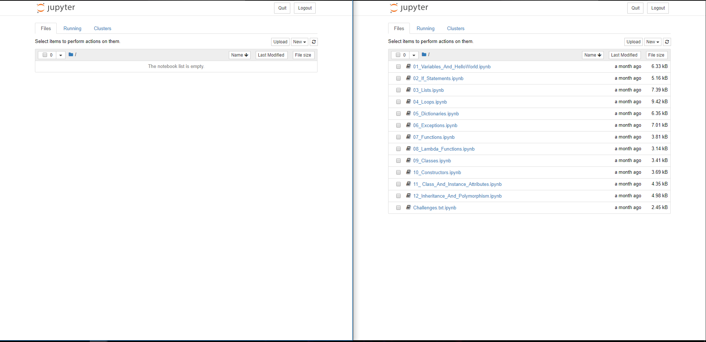

# Jupyter Notebooks

## Jupyter Notebooks

Remember earlier when we installed `jupyter`? Jupyter is an interactive notebook that allows live code execution and plain text for note taking. This means we can have code AND notes in one document organized in blocks called `cells`. We will also be using Git to access these notebooks and download them to your computer so you can work along.

## Clonin' the Repo

* Navigate to [https://github.com/ElevenfiftyAcademy/PythonPreworkNotebooks.git](https://github.com/ElevenfiftyAcademy/PythonPreworkNotebooks.git)
* click the green 'clone or download' button
* then click Download ZIP



* when the download stops, right click on the new pane in the bottom of the browser
* click show in folder
* a new window will appear, this is the file explorer
* the files we downloaded are contained in a compressed archive, meaning that they are bundled up to save space. We need to extract them to a new folder to use them
* for windows, there will be a button titled `extract`. Click extract, then there will be a button that appears below it that says extract all. Click extract all
* a new window will appear
* use the browse button to navigate to where the PythonProjects folder is located that also has our html and css prework and click extract again, it will look like the following image



* this will place all of the content from the repository inside of that folder

## More Terminal Talk

The terminal can be a bit scary at first but we will go over a few of the commands that you need to know to navigate around the terminal. THIS IS IMPORTANT as we need this to open the files we just downloaded in jupyter notebook

* `cd` - change directory, put a folder name after to 'change to that directory'
* `cd..` - this goes back to containing folder
* `dir` - this shows all contents inside the directory you are on, so you can use cd to those folders
* `ls` - this is the equivalent to `dir` but for mac systems
* `mkdir [name]` creates a new folder where \[name\] is the name of the folder

We will be using the terminal a lot in this course so take some time and play around with the commands listed above

## Opening our Repository in Jupyter

* Open terminal and CD \(change directory\) until you get to the PythonPreworkNotebooks. If you extracted the .zip file inside the PythonPrework file, and your Python\_Projects file is on your desktop, it should look something like this

```text
c:/users/*yourname*> cd Desktop
c:/users/*yourname*/Desktop> cd Python_Projects
c:/users/*yourname*/Desktop/Python_Projects>cd prework
c:/users/*yourname*/Desktop/Python_Projects/prework> dir
  HTMLPrework
  CSSPrework
  PythonPrework <-- we want this one

c:/users/*yourname*/Desktop/Python_Projects/prework> cd PythonPrework
c:/users/*yourname*/Desktop/Python_Projects/PythonPrework>
```

* Once you see PythonPrework at the end by that angle bracket, you're done! Now that we're here, type the following command and press enter

```text
c:/users/*yourname*/Desktop/Python_Projects/PythonPrework> jupyter notebook
```

* This should open a new browser window and you will see a list of folders. Click on 01\_Fundamentals, and start at 01\_Variables\_And\_HelloWorld.py. This is the last section of the prework and will be done in jupyter notebook

## Jupyter Tips

* ctrl+c when in terminal will exit the jupyter session
* If you run into a lot of errors or made a lot of changes, we can click `kernel > restart`. To reset the cells with code
* We can create a new notebook by clicking the home tab in your browser \( or the jupyter logo at the top left of the page \), and clicking `new` at the top right.

## Challenge

Try creating your own Jupyter Notebook in a new folder called `prework_code_along` and follow along in the prework \(remember you just need the folder it doesn't need to have files to open in jupyter\). Put this new folder inside your PythonPrework. Work through the prework notebook in the note book you just created.

**Note:** When you either take a break or are done using the notebook, Remember to hit ctrl+c in the terminal. This is because jupyter creates a locally hosted server on your computer. If you don't exit the server correctly, it will still be running in the background.

## Challenge Solution

Open up terminal and navigate back to where we left off in _Opening our Repo in Jupyter_ section. Then run the following command in terminal

`mkdir prework_code_along`  
**mkdir** stands for make directory \(folder\). Everything after mkdir is what we call the folder. then CD \(change directory\) into prework\_code\_along \(the folder we just made\) using the following command  
`cd prework_code_along`  
Then, to finish off the challenge, run `jupyter notebook` in terminal, and watch as it appears in your browser.

## Starting the Notebooks

After finishing the challenge, you will have 2 notebooks. To run both of these notebooks, we need to open up a new terminal session and get back to where we were. Use the _Opening our Repo in Jupyter_  section to reopen the first notebook. 


When we run these commands, we get two new browser windows named 'Home'. Put these windows side by side like the following image



In the empty notebook, create a new file by clicking new near the top right. Name it 01\_Variables\_and\_HelloWorld. Follow along through all 12 modules of the prework while working in the `prework_code_along` notebook. Think of a jupyter session as a notebook. Take notes, experiment with the course material, write your own cells and have fun learning the fundamentals of Python

